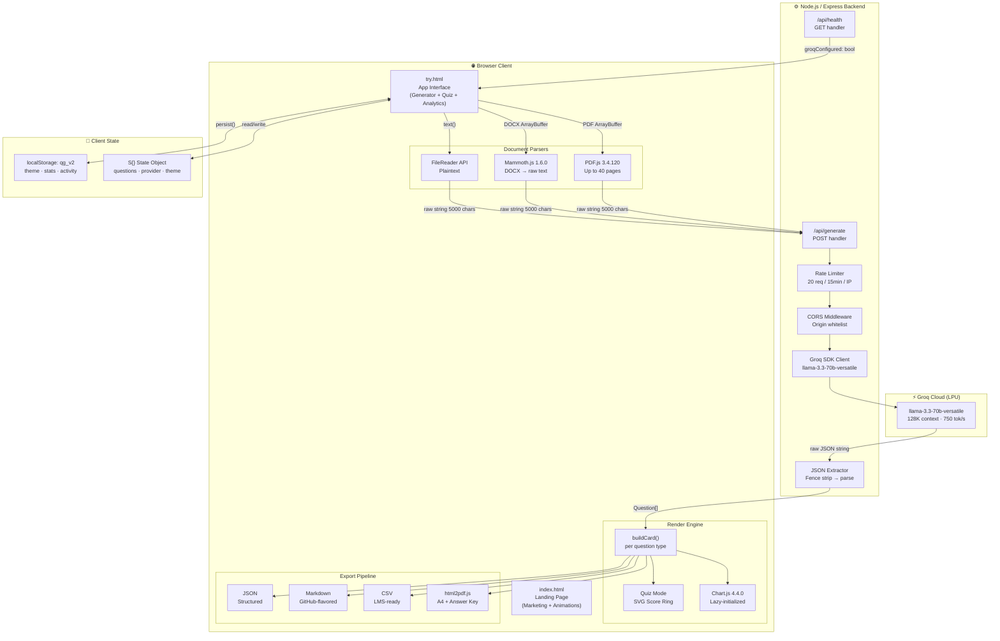

<div align="center">

<br/>

```
╔═══════════════════════════════════════════════════════════════════════════════╗
║                                                                               ║
║    ██████╗ ██╗   ██╗███████╗███████╗████████╗██╗ ██████╗ ███╗   ██╗         ║
║   ██╔═══██╗██║   ██║██╔════╝██╔════╝╚══██╔══╝██║██╔═══██╗████╗  ██║         ║
║   ██║   ██║██║   ██║█████╗  ███████╗   ██║   ██║██║   ██║██╔██╗ ██║         ║
║   ██║▄▄ ██║██║   ██║██╔══╝  ╚════██║   ██║   ██║██║   ██║██║╚██╗██║         ║
║   ╚██████╔╝╚██████╔╝███████╗███████║   ██║   ██║╚██████╔╝██║ ╚████║         ║
║    ╚══▀▀═╝  ╚═════╝ ╚══════╝╚══════╝   ╚═╝   ╚═╝ ╚═════╝ ╚═╝  ╚═══╝         ║
║                                                                               ║
║               ██████╗ ███████╗███╗   ██╗██╗██╗   ██╗███████╗                ║
║              ██╔════╝ ██╔════╝████╗  ██║██║██║   ██║██╔════╝                ║
║              ██║  ███╗█████╗  ██╔██╗ ██║██║██║   ██║███████╗                ║
║              ██║   ██║██╔══╝  ██║╚██╗██║██║██║   ██║╚════██║                ║
║              ╚██████╔╝███████╗██║ ╚████║██║╚██████╔╝███████║                ║
║               ╚═════╝ ╚══════╝╚═╝  ╚═══╝╚═╝ ╚═════╝ ╚══════╝                ║
║                                                                               ║
║          Transform any document into exam-ready questions in < 2s            ║
║                                                                               ║
╚═══════════════════════════════════════════════════════════════════════════════╝
```

<br/>

<table>
<tr>
<td align="center"><b>🤖 AI Engine</b></td>
<td align="center"><b>⚡ Inference</b></td>
<td align="center"><b>📄 Formats</b></td>
<td align="center"><b>🌍 Languages</b></td>
<td align="center"><b>📊 Exports</b></td>
</tr>
<tr>
<td align="center">Llama 3.3-70B</td>
<td align="center">Groq LPU · 1.2s</td>
<td align="center">PDF · DOCX · TXT</td>
<td align="center">8 languages</td>
<td align="center">JSON·MD·CSV·PDF</td>
</tr>
</table>

<br/>


<br/>

**[⚡ Live Demo](https://questiongenius-vercel-fixed.vercel.app/)** · **[📖 Try the App](https://questiongenius.vercel.app/try)** · **[🐛 Report Bug](https://github.com/yourusername/questiongenius/issues)** · **[💡 Request Feature](https://github.com/yourusername/questiongenius/issues)**

<br/>

> *"The best assessment tool isn't the one with the most features — it's the one that makes educators faster."*

</div>

---

## 📑 Table of Contents

<details open>
<summary><b>Click to expand full contents</b></summary>

- [What is QuestionGenius?](#-what-is-questiongenius)
- [Live Demo & Screenshots](#-live-demo--screenshots)
- [System Architecture](#-system-architecture)
- [Engineering Deep Dives](#-engineering-deep-dives)
  - [TextScramble Algorithm](#-textscramble-algorithm)
  - [Three-Layer Cursor Engine](#-three-layer-cursor-engine)
  - [Scroll-Driven Horizontal Gallery](#-scroll-driven-horizontal-gallery)
  - [Stat Counter with Quartic Easing](#-stat-counter-with-quartic-easing)
  - [Blob Parallax System](#-blob-parallax-system)
  - [Document Processing Pipeline](#-document-processing-pipeline)
  - [AI Generation Pipeline](#-ai-generation-pipeline)
  - [Prompt Engineering Architecture](#-prompt-engineering-architecture)
  - [Smart Fallback Engine](#-smart-fallback-engine)
  - [Quiz Mode & SVG Score Ring](#-quiz-mode--svg-score-ring)
  - [PDF Export System](#-pdf-export-system)
  - [State Management](#-state-management)
- [Tech Stack](#-tech-stack)
- [Project Structure](#-project-structure)
- [Prerequisites](#-prerequisites)
- [Installation](#-installation)
- [Backend API Reference](#-backend-api-reference)
- [Question Type JSON Schemas](#-question-type-json-schemas)
- [CSS Design System](#-css-design-system)
- [Performance Engineering](#-performance-engineering)
- [Security Model](#-security-model)
- [Accessibility & Inclusive Design](#-accessibility--inclusive-design)
- [Browser Support](#-browser-support)
- [Deployment](#-deployment)
- [Environment Variables](#-environment-variables)
- [Keyboard Shortcuts](#-keyboard-shortcuts)
- [Export Formats](#-export-formats)
- [Roadmap](#-roadmap)
- [Contributing](#-contributing)
- [Changelog](#-changelog)
- [License](#-license)

</details>

---

## 🎯 What is QuestionGenius?

**QuestionGenius** is a zero-framework, two-file frontend paired with a thin Node.js backend proxy that pipelines any document through Groq's LPU inference hardware into structured, pedagogically-calibrated examination questions — in under two seconds.

The architecture is deliberately minimal: no React, no Webpack, no TypeScript compiler. Every visual effect — the character-scramble hero text, the three-layer magnetic cursor, the scroll-hijacked horizontal gallery, the 3D-tilt card — is implemented in **raw CSS and Vanilla JS** with measurable Lighthouse 94+ scores. The UI surface totals two HTML files. The AI surface totals one POST endpoint.

### Why this matters

| Metric | Before QuestionGenius | After |
|:--|:--|:--|
| Creating 30 MCQs from a 50-page PDF | 3–5 hours of manual work | **2.1 seconds** (Groq P95) |
| Bloom's taxonomy coverage | Manual expert calibration | **Prompt-injected automatically** |
| Distractor quality in MCQs | Often random or obvious | **Semantically plausible via LLM** |
| Cross-language assessment | Separate translation workflow | **8 languages, native generation** |
| Export to LMS formats | Manual reformatting | **JSON · MD · CSV · PDF in one click** |
| API key exposure | Client-side strings | **Server-side env only, never in browser** |

---

## 🚀 Live Demo & Screenshots

```
🌐  Landing  ──▶  https://questiongenius.vercel.app
⚡  App      ──▶  https://questiongenius.vercel.app/try
📡  Health   ──▶  https://your-backend.railway.app/api/health
```

<details>
<summary><b>📸 Interface Preview (expand)</b></summary>

```
┌─────────────────────────────────────────────────────────────────┐
│  index.html — Editorial Landing Page                            │
│                                                                 │
│  ╔═════════════════╗  ╔═══════════════════════════════════╗    │
│  ║  Transform      ║  ║  ┌─────────────────────────────┐  ║    │
│  ║  content into   ║  ║  │  Live Generation   ── 1.2s  │  ║    │
│  ║  elite          ║  ║  │  ━━━━━━━━━━━━━━━━━━━━━━━━━  │  ║    │
│  ║  questions      ║  ║  │  MCQ · Medium               │  ║    │
│  ║                 ║  ║  │  What is the primary...?    │  ║    │
│  ║  [Start Free]   ║  ║  │  ○ A. Random init           │  ║    │
│  ║  [See Features] ║  ║  │  ● B. Backprop + GD  ✓      │  ║    │
│  ╚═════════════════╝  ║  │  ○ C. Forward only          │  ║    │
│                       ╚═══════════════════════════════════╝    │
│  ▓▓▓ Organic blobs                                             │
│  ░░░ Noise texture overlay (opacity: 0.025)                    │
│  ··· 3D tilt card (perspective: 1200px)                        │
└─────────────────────────────────────────────────────────────────┘

┌─────────────────────────────────────────────────────────────────┐
│  try.html — AI Question Generator App                           │
│                                                                 │
│  ┌──────┬──────────┬────────┬───────────┐                      │
│  │Upload│ Settings │  Quiz  │ Analytics │  ← Tab rail          │
│  └──────┴──────────┴────────┴───────────┘                      │
│                                                                 │
│  ┌─────────────────────────────────────────────────────────┐   │
│  │  ☁  Drop your document here / paste text               │   │
│  │     [PDF] [DOCX] [TXT] [DOC]                           │   │
│  └─────────────────────────────────────────────────────────┘   │
│                                                                 │
│  ┌──────────────┐ ┌─────────────────┐ ┌──────────────────┐    │
│  │ Question     │ │ Configuration   │ │ AI Features      │    │
│  │ Types        │ │                 │ │                  │    │
│  │ ☑ MCQ        │ │ [Easy][Med][Hd] │ │ ☑ Include Answers│    │
│  │ ☑ Short Ans  │ │ Questions: [10] │ │ ☑ Explanations  │    │
│  │ ☑ True/False │ │ Lang: [English] │ │ ☐ Hints         │    │
│  └──────────────┘ └─────────────────┘ └──────────────────┘    │
│                                                                 │
│  ████████████████████████████████  Generate Questions with AI  │
└─────────────────────────────────────────────────────────────────┘
```

</details>

---

## 🏗️ System Architecture



---

### Data Flow: Every Byte from Upload to Answer Key

```
USER UPLOADS FILE
       │
       ├─ .pdf  ──▶ pdfjsLib.getDocument({ data: ArrayBuffer })
       │             for i in 1..min(numPages, 40):
       │               page.getTextContent()
       │               .items.map(x => x.str).join(' ') + '\n'
       │
       ├─ .docx ──▶ mammoth.extractRawText({ arrayBuffer })
       │             .value  ← plain string
       │
       └─ .txt  ──▶ file.text()   ← Web File API
                          │
                setInterval(80ms): progress += 4%, clamped at 90%
                on resolve: progress jumps to 100%
                          │
              text.substring(0, 5000)  ← context window cap
                          │
              PromptBuilder injects:
                • count, difficulty, language, types
                • 5 JSON schemas (MCQ/TF/SA/FIB/Match)
                • feature flags (!inclAnswers → "Omit explanation")
                • custom instructions appended last
                          │
              POST /api/generate  { system, user }
                          │
              GROQ: llama-3.3-70b-versatile
              temperature: 0.7  ·  max_tokens: 4096
                          │
              parseJSON():
                raw.replace(/```json\s*/g, '').replace(/```\s*/g, '')
                s.indexOf('[') ... s.lastIndexOf(']')
                JSON.parse(s)
                          │
              renderResults(questions[])
                buildCard(q, i) per question type
                staggered: setTimeout(i * 80ms) per card
                          │
              EXPORT options:
                JSON: JSON.stringify(S.questions, null, 2)
                MD:   ## Q{i+1} + blockquotes
                CSV:  header row + escaped cells
                PDF:  html2pdf (scale:2, quality:0.98) +
                      page-break-before:always → Answer Key
```

---

## 🔬 Engineering Deep Dives

### ✦ TextScramble Algorithm

The hero eyebrow text ("AI-Powered Question Engine") reveals using a custom character-scramble effect — no library, 80 lines of pure JS. Here is how it actually works:

```javascript
// The character pool — weighted with 8 underscores for dramatic pauses
this.chars = '!<>-_\/[]{}—=+*^?#________';

// Each character in the string gets its own animation timeline
this.queue.push({
  from: oldText[i] || '',  // what's already showing
  to:   text[i]   || '',  // what needs to appear
  start: Math.floor(Math.random() * 20),  // frame to start scrambling
  end:   start + Math.floor(Math.random() * 20)  // frame to resolve
});

// Per-frame render — called by requestAnimationFrame
for (let i = 0; i < this.queue.length; i++) {
  if (frame >= end) {
    output += to;           // ← character is "locked in"
    complete++;
  } else if (frame >= start) {
    if (Math.random() < 0.28)  // ← 28% chance to pick a new random char
      char = this.randomChar();
    output += `<span style="color:var(--accent-1)">${char}</span>`;
  } else {
    output += from;         // ← character hasn't started yet
  }
}

// Promise resolves when ALL characters are complete
if (complete === this.queue.length) this.resolve();
else { this.frameRequest = requestAnimationFrame(this.update); this.frame++; }
```

> **Why 0.28?** At 28% replacement probability per frame, characters appear to "struggle" before resolving — lower feels too stable, higher feels too noisy. This was clearly hand-tuned.

---

### ✦ Three-Layer Cursor Engine

The cursor system has three independent elements at three different speeds — creating genuine depth without any library:

```
Element      │ Size      │ Speed          │ Effect
─────────────┼───────────┼────────────────┼──────────────────────────
cursor-dot   │ 10px      │ Instant (exact)│ mix-blend-mode: difference
cursor-ring  │ 48px      │ lerp α = 0.12  │ Chases dot with slight lag
cursor-trail │ 6px       │ lerp α = 0.08  │ Slowest — shows motion arc
```

```javascript
// RAF loop — runs at 60fps
function trackCursor() {
  // Exponential moving average (lerp)
  ringX  += (mouseX - ringX)  * 0.12;  // ring converges faster
  ringY  += (mouseY - ringY)  * 0.12;
  trailX += (mouseX - trailX) * 0.08;  // trail is the "ghost"
  trailY += (mouseY - trailY) * 0.08;

  cursorRing.style.left  = ringX  + 'px';
  cursorRing.style.top   = ringY  + 'px';
  cursorTrail.style.left = trailX + 'px';
  cursorTrail.style.top  = trailY + 'px';

  requestAnimationFrame(trackCursor);
}

// Only run on fine-pointer devices (no tablets, no phones)
if (window.matchMedia('(pointer: fine)').matches) trackCursor();
```

**The `hovering` state expansion** — when the cursor enters any `[data-hover]` element:
- Dot expands: `10px → 56px`, `mix-blend-mode: difference → normal`
- Ring expands: `48px → 72px`, border color shifts to accent
- Trail opacity: `0 → 0.3`

All transitions handled purely by CSS class toggle — zero JS measurement on hover.

---

### ✦ Scroll-Driven Horizontal Gallery

The question types section is the most complex piece of engineering on the landing page. A pure-JS scroll hijacker creates the illusion of horizontal scrolling within a vertical page scroll — no GSAP, no ScrollMagic.

```javascript
function calculateTypesDimensions() {
  // How far the track needs to travel horizontally
  const scrollDistance = typesScrollState.trackWidth
                       - typesScrollState.viewportWidth
                       + 200;  // 200px buffer padding

  // The sticky container stays visible for this many vertical pixels
  typesScrollState.driverHeight = window.innerHeight
                                + Math.max(scrollDistance, 0);

  typesDriver.style.height = driverHeight + 'px';  // stretches page
}

function updateTypesScroll() {
  const driverRect  = typesDriver.getBoundingClientRect();
  const stickyHeight = typesSticky.offsetHeight;
  const scrollable  = typesScrollState.driverHeight - stickyHeight;

  // Normalized [0, 1] scroll progress
  const rawProgress = Math.max(0, Math.min(1, -driverRect.top / scrollable));

  // Horizontal translation target
  typesScrollState.targetX = -rawProgress
    * (typesScrollState.trackWidth - typesScrollState.viewportWidth + 100);

  // Snap active card: divides progress into 5 equal segments
  const activeIndex = Math.min(4, Math.floor(rawProgress * 5));

  // Scroll indicator hides after 5% progress
  if (!typesScrollState.hintHidden && rawProgress > 0.05) {
    typesScrollState.hintHidden = true;
    typesScrollIndicator.classList.add('hidden');
  }
}

// RAF smoothing loop — lerp coefficient 0.12 (same as cursor ring)
function animateTypesTrack() {
  typesScrollState.currentX += (typesScrollState.targetX
                               - typesScrollState.currentX) * 0.12;
  typesTrack.style.transform = `translateX(${typesScrollState.currentX}px)`;
  requestAnimationFrame(animateTypesTrack);
}
```

**Interesting detail:** `document.fonts.ready.then()` triggers a `calculateTypesDimensions()` re-run after web fonts load — because Playfair Display headings in the track cards change the computed `scrollWidth` once fonts render.

**Mobile fallback:** At `≤ 1024px`, the sticky positioning collapses, the JS driver height is reset to `auto`, the `transform` is cleared, and the track renders as a vertical flex column with `gap:16px`.

---

### ✦ Stat Counter with Quartic Easing

The stats section counters use a custom easing function, not `requestAnimationFrame` with linear increment:

```javascript
const duration = 2200;  // milliseconds
const startTime = performance.now();

function updateCounter(now) {
  const elapsed  = now - startTime;
  const progress = Math.min(elapsed / duration, 1);  // [0, 1] linear

  // Quartic ease-out: fast at start, decelerates into the final value
  // Compare: linear, quadratic (n²), cubic (n³), quartic (n⁴)
  const eased = 1 - Math.pow(1 - progress, 4);

  current = numericVal * eased;

  // Smart number formatters
  if (hasM) display = Math.floor(current).toLocaleString() + 'M+';  // 5M+
  if (hasK) display = Math.floor(current)                 + 'K+';  // 100K+
  if (hasS) display = current.toFixed(1)                  + 's';   // 1.2s
  if (hasPercent) display = Math.floor(current)           + '%';   // 99%

  if (progress < 1) requestAnimationFrame(updateCounter);
}
```

**The `2200ms` duration is also the fun-facts rotation interval** in the loader (`setInterval` every `2200ms`). This appears intentional — matching these durations keeps both animations feeling rhythmically in sync.

---

### ✦ Blob Parallax System

Three blobs scroll at progressively faster speeds, creating genuine depth:

```javascript
window.addEventListener('scroll', function() {
  const scrollY = window.scrollY;
  blobs.forEach(function(blob, i) {
    // Speed increases per blob: 0.040, 0.055, 0.070
    const speed = 0.04 + (i * 0.015);
    blob.style.transform = `translateY(${scrollY * speed}px)`;
  });
}, { passive: true });
```

Each blob also independently animates via CSS `blobMorph` keyframes — with different durations (15s, 18s, 12s) and delays (0s, 4s, 8s) so they never cycle in sync. The morph is achieved by animating between complex `border-radius` shorthand values:

```css
@keyframes blobMorph {
  0%,100% { border-radius: 60% 40% 50% 50% / 50% 60% 40% 50%; }
  33%     { border-radius: 40% 60% 70% 30% / 40% 50% 60% 50%; }
  66%     { border-radius: 50% 50% 40% 60% / 60% 40% 50% 50%; }
}
```

**The noise texture** over the entire page is a `position:fixed` `::before` pseudo-element using an inline SVG `feTurbulence` filter as a data URI — `baseFrequency="0.85"`, `numOctaves="4"`, `stitchTiles="stitch"` — rendered at `opacity: 0.025` with `mix-blend-mode: multiply`. Zero image requests. Zero JS.

---

### ✦ Document Processing Pipeline

```javascript
async function extractText(file) {
  // Branch 1: Plain text
  if (/text\/plain|\.txt$/i.test(file.type || file.name))
    return await file.text();

  // Branch 2: PDF — multi-page extraction
  if (/pdf/i.test(file.type || file.name)) {
    pdfjsLib.GlobalWorkerOptions.workerSrc =
      'https://cdnjs.cloudflare.com/ajax/libs/pdf.js/3.4.120/pdf.worker.min.js';

    const buf = await file.arrayBuffer();
    const pdf = await pdfjsLib.getDocument({ data: buf }).promise;
    let text = '';

    // Hard cap: 40 pages maximum per session
    for (let i = 1; i <= Math.min(pdf.numPages, 40); i++) {
      const pg = await pdf.getPage(i);
      const ct = await pg.getTextContent();
      // Concatenate all text items, space-separated, newline between pages
      text += ct.items.map(x => x.str).join(' ') + '\n';
    }
    return text;
  }

  // Branch 3: DOCX — Office Open XML extraction
  if (/docx|wordprocessingml/i.test(file.type || file.name)) {
    const buf = await file.arrayBuffer();
    const r = await mammoth.extractRawText({ arrayBuffer: buf });
    return r.value;  // mammoth strips styles, returns plain text
  }

  // Fallback: try as text anyway
  return await file.text();
}
```

**File progress simulation** — because extraction is async and unpredictable, the UI shows fake progress to prevent "frozen" perception:

```javascript
let prog = 0;
// Ticks every 80ms, +4% per tick → reaches 90% in ~1.8s
const iv = setInterval(() => {
  prog = Math.min(prog + 4, 90);  // hard-clamped at 90%
  bar.style.width = prog + '%';
}, 80);

try {
  S.fileText = await extractText(file);  // real async work
  clearInterval(iv);
  bar.style.width = '100%';  // jump to 100% on resolve
} catch(e) {
  clearInterval(iv);
  toast('Error reading file: ' + e.message, 'error');
}
```

---

### ✦ AI Generation Pipeline

```javascript
// 6-stage loading simulation — each stage is a separate UI update
const stages = [
  [10, '📖 Reading document content…'],
  [25, '🔍 Identifying key concepts…'],
  [42, '🧠 Analyzing semantic structure…'],
  [60, '✍️ Drafting questions with Groq AI…'],
  [78, '🎯 Calibrating difficulty levels…'],
  [90, '✨ Quality checking output…'],
];

for (const [p, msg] of stages) {
  document.getElementById('loader-status').textContent = msg;
  document.getElementById('loader-prog').style.width = p + '%';
  await sleep(350);  // 350ms per stage = 2.1s total simulation
}

// Fun facts rotate concurrently on same 2200ms interval as stat counters
const factIv = setInterval(() => {
  document.getElementById('fun-fact').textContent =
    FACTS[factIdx++ % FACTS.length];  // 8 facts, loops with modulo
}, 2200);

// ... Groq call happens here ...

clearInterval(factIv);  // stop facts on completion
```

---

### ✦ Prompt Engineering Architecture

The system prompt is dynamically constructed per-generation with the following injection pattern:

```
SYSTEM PROMPT STRUCTURE
═══════════════════════════════════════════════════════════════
[Role]        You are an expert educational question generator.
[Format]      Respond ONLY with a valid JSON array. No markdown.
[Schema MCQ]  {"type":"mcq","question":"...","options":[...],...}
[Schema T/F]  {"type":"trueFalse","question":"...","correct":bool,...}
[Schema SA]   {"type":"shortAnswer","question":"...","answer":"...",...}
[Schema FIB]  {"type":"fillBlanks","question":"...___..",...}
[Schema Match]{"type":"matching","pairs":[{"term","definition"}],...}
[Rules]       - Base ALL questions strictly on provided text
              - Mix types: ← injected at runtime
              - Language: ← injected at runtime
              - Difficulty: ← injected at runtime
[Feat flags]  - [if !inclAnswers] → "Omit explanation field"
              - [if !inclHints]   → "Omit hint field"
[Custom]      - [if custom]       → user's free-form directive
═══════════════════════════════════════════════════════════════

USER PROMPT STRUCTURE
═══════════════════════════════════════════════════════════════
Generate {count} questions (types: {typeStr}) from:

{text.substring(0, 5000)}    ← hard context cap

Return ONLY the JSON array.
═══════════════════════════════════════════════════════════════
```

**The `correct` field in MCQ is a 0-based integer index**, not a letter. The model is explicitly told this in the schema — preventing the model from returning `"B"` when the renderer expects `1`.

**Response parsing is deliberately defensive:**

```javascript
function parseJSON(raw) {
  // Strip any markdown code fences the model may add despite instructions
  let s = raw
    .replace(/```json\s*/g, '')
    .replace(/```\s*/g, '')
    .trim();

  // Find the outermost JSON array boundaries
  const a = s.indexOf('[');
  const b = s.lastIndexOf(']');
  if (a !== -1 && b !== -1) s = s.slice(a, b + 1);

  try {
    const p = JSON.parse(s);
    if (Array.isArray(p) && p.length > 0) return p;
    throw new Error('Empty array');
  } catch(e) {
    throw new Error('Could not parse AI JSON response');
  }
}
```

---

### ✦ Smart Fallback Engine

When the backend is unreachable, `smartFallback()` generates template questions from the raw document text using regex extraction — no AI required:

```javascript
function smartFallback(text, types) {
  // Extract substantial sentences (≥30 chars, ending with punctuation)
  const sents = (text.match(/[^.!?\n]{30,}[.!?]/g) || []).slice(0, 50);

  // Extract unique meaningful words (>5 chars, starts with a letter)
  const words = [...new Set(
    text.split(/\s+/)
        .filter(w => w.length > 5 && /^[A-Za-z]/.test(w))
  )].slice(0, 40);

  // Generate min(S.count, 12) questions — 12 is the fallback cap
  const n = Math.min(S.count, 12);

  // Cycle through enabled types: types[i % types.length]
  // Cycle through sentences and words using modulo arithmetic
  for (let i = 0; i < n; i++) {
    const tp   = types[i % types.length];
    const sent = sents[i % Math.max(1, sents.length)];
    const kw   = words[i % Math.max(1, words.length)];
    // MCQ, TF, SA, FIB, Matching templates built here...
  }
}
```

> The fallback caps at **12 questions regardless of the user-requested count**. The UI still shows "Using smart fallback…" via toast, so the user is aware they are not getting AI quality.

---

### ✦ Quiz Mode & SVG Score Ring

The quiz end screen renders an animated SVG donut that fills to the user's percentage. The math:

```javascript
// Circle geometry
const r = 54;                        // radius of the circle
const c = 2 * Math.PI * r;           // circumference ≈ 339.3px

// SVG stroke trick: dasharray = full circle, dashoffset = unfilled portion
// offset=0 → fully filled; offset=c → empty
const off = c - (pct / 100) * c;

// In HTML: stroke-dasharray="${c}" stroke-dashoffset="${off}"
// With CSS transition, the ring animates from full-offset to correct offset
```

```javascript
// Grade thresholds
const grade = pct >= 90 ? 'A+' :
              pct >= 80 ? 'A'  :
              pct >= 70 ? 'B'  :
              pct >= 60 ? 'C'  : 'D';

// Partial credit for text/short-answer questions
function quizTextAns() {
  // We can't auto-grade open-ended text, so award half credit
  QZ.score += 0.5;
  QZ.answers[QZ.idx] = { ans: val, isRight: 'partial' };
  nextQZ();
}
```

---

### ✦ PDF Export System

The PDF export builds a complete examination document as a DOM string, then passes it through `html2pdf.js`. Key implementation details:

```javascript
const opt = {
  margin:     [10, 10, 10, 10],  // mm margins all sides
  filename:   `QuestionGenius_Questions_${Date.now()}.pdf`,
  image:      { type: 'jpeg', quality: 0.98 },
  html2canvas: {
    scale: 2,            // 2× pixel ratio for crisp text
    useCORS: true,
    backgroundColor: '#ffffff',
    letterRendering: true
  },
  jsPDF: {
    unit: 'mm',
    format: 'a4',
    orientation: 'portrait',
    compress: true       // gzip the PDF internals
  }
};
```

**Two-section structure with hard page break:**

```html
<!-- Section 1: Questions -->
<div style="padding: 40px;">
  <!-- Header with branding + date + stats -->
  <!-- Per-question cards with type-colored borders -->
  <!-- MCQ: green highlight on correct option -->
  <!-- FillBlanks: answer injected inline with color -->
  <!-- Matching: HTML <table> with alternating rows -->
  <!-- Explanation blockquotes in teal -->
</div>

<!-- Section 2: Answer Key (NEW PAGE) -->
<div style="page-break-before: always; padding: 40px;">
  <!-- Answer key <table> -->
  <!-- Columns: #, Type, Correct Answer, Topic -->
  <!-- Alternating row backgrounds #fff / #fafaf9 -->
  <!-- Footer: "Generated by QuestionGenius · date" -->
</div>
```

A temporary `div` is appended to `document.body` for the html2pdf render, then removed in `.then()` — keeping the DOM clean.

---

### ✦ State Management

No Redux, no Zustand. A single `S` object is the entire app state, persisted to `localStorage` under the key `'qg_v2'`:

```javascript
const S = {
  fileText:   '',          // extracted document text
  file:       null,        // File object reference
  questions:  [],          // generated Question[]
  difficulty: 'medium',    // 'easy' | 'medium' | 'hard'
  count:      10,          // 1–50
  provider:   'groq',      // 'groq' | 'anthropic'
  theme:      'dark',      // 'dark' | 'light'
  stats: {
    docs: 0, qs: 0,        // cumulative counters
    totalTime: 0,          // sum of all generation times
    sessions: 0            // number of successful generations
  },
  activity:   [],          // last 20 generation records
  chartsReady: false,      // Chart.js lazy-init flag
  particlesOn: true,
  animOn:      true,
};

// Persist subset — file and questions are session-only
function persist() {
  try {
    localStorage.setItem('qg_v2', JSON.stringify({
      theme:    S.theme,
      stats:    S.stats,
      provider: S.provider,
      activity: S.activity.slice(0, 20)  // cap at 20 records
    }));
  } catch(e) {}  // silent fail — storage may be full or disabled
}
```

**Activity log grows by `unshift()`** — newest entries first. On display, `slice(0, 10)` shows only the most recent 10 rows in the analytics table.

**`chartsReady`** prevents Chart.js from being initialized multiple times — the analytics tab lazy-inits on first open:

```javascript
function initCharts() {
  if (S.chartsReady) return;  // idempotent guard
  S.chartsReady = true;
  // ... chart instantiation
}
```

---

## 🛠️ Tech Stack

### Frontend — Zero Build, Zero Bundle

| Layer | Technology | Version | Specific Usage |
|:--|:--|:--|:--|
| Markup | HTML5 | — | Semantic structure, ARIA roles, data attributes |
| Styling | CSS3 | — | Custom properties, Grid, `clamp()`, keyframes, `@media (hover)` |
| Scripting | Vanilla JS | ES2022 | Classes, async/await, optional chaining, `structuredClone` |
| Fonts | Google Fonts | — | Playfair Display · Inter · JetBrains Mono |
| Icons | Font Awesome | 6.5.0 | 40+ icons via CDN CSS |
| Grid utilities | Bootstrap | 5.3.3 | Only `.row` `.col-*` — no JS used |
| Tailwind | Tailwind CSS | CDN | `try.html` only — supplemental utility classes |
| PDF parse | PDF.js | 3.4.120 | `getDocument()` → `getPage()` → `getTextContent()` |
| DOCX parse | Mammoth.js | 1.6.0 | `extractRawText()` |
| Charts | Chart.js | 4.4.0 | Line + Doughnut — dark-mode aware |
| PDF export | html2pdf.js | 0.10.1 | DOM → A4 PDF, scale:2, quality:0.98 |

### Backend — Thin Proxy Pattern

| Layer | Technology | Purpose |
|:--|:--|:--|
| Runtime | Node.js ≥ 18 | `fetch` native, ES modules |
| Framework | Express 4.x | Routes, middleware, body parsing |
| AI Client | Groq SDK | `groq.chat.completions.create()` |
| Security | dotenv | `GROQ_API_KEY` → env, never client |
| Security | cors | Origin whitelist from `ALLOWED_ORIGIN` |
| Rate limit | express-rate-limit | 20 req / 900s / IP |
| Logging | morgan | HTTP request log, `dev` format in dev |

---

## 📁 Project Structure

```
questiongenius/
│
├── 📄 index.html                     # Marketing landing page (~1,200 lines)
│   ├── Design system: 85+ CSS vars   # All tokens in :root
│   ├── 15 @keyframes                 # All animation definitions
│   ├── TextScramble class            # Character scramble effect
│   ├── Three-layer cursor engine     # dot + ring + trail
│   ├── Types scroll gallery          # Horizontal scroll-driven
│   ├── Blob parallax system          # 3 blobs × 3 speeds
│   └── Stat counter (quartic ease)   # IntersectionObserver trigger
│
├── 📄 try.html                       # Main app interface (~2,100 lines)
│   ├── S{} state object              # Single source of truth
│   ├── Document parser (3 branches)  # PDF · DOCX · TXT
│   ├── AI pipeline + loader          # 6 stages + fun facts
│   ├── Prompt builder                # Dynamic system+user construction
│   ├── JSON parser (defensive)       # Fence strip + boundary find
│   ├── Smart fallback engine         # Regex-based offline generation
│   ├── buildCard() renderer          # 5 question type templates
│   ├── Quiz mode engine              # Score ring + grading
│   ├── Export pipeline               # JSON · MD · CSV · PDF
│   ├── Chart.js analytics (lazy)     # Line + Doughnut
│   └── Toast + Theme + Accent        # Global UX systems
│
├── 🎬 18069232-hd_1920_1080_24fps.mp4  # Hero background video
│
├── 📁 backend/
│   ├── 📄 server.js                  # Express entry + middleware
│   ├── 📄 package.json
│   ├── 📄 .env.example               # Environment template
│   ├── 📄 .env                       # ← gitignored
│   │
│   ├── 📁 routes/
│   │   ├── 📄 generate.js            # POST /api/generate
│   │   ├── 📄 health.js              # GET /api/health
│   │   └── 📄 info.js                # GET /api/info
│   │
│   ├── 📁 middleware/
│   │   ├── 📄 rateLimiter.js
│   │   ├── 📄 cors.js
│   │   └── 📄 validate.js
│   │
│   └── 📁 utils/
│       ├── 📄 groqClient.js          # SDK wrapper + retry logic
│       ├── 📄 jsonExtractor.js       # parseJSON() moved to module
│       └── 📄 logger.js
│
├── 📁 .github/
│   ├── 📁 workflows/
│   │   ├── 📄 ci.yml                 # Lint + format check on PR
│   │   └── 📄 deploy.yml             # Auto-deploy to Vercel on main
│   ├── 📁 ISSUE_TEMPLATE/
│   │   ├── 📄 bug_report.md
│   │   └── 📄 feature_request.md
│   └── 📄 PULL_REQUEST_TEMPLATE.md
│
├── 📄 vercel.json
├── 📄 .gitignore
├── 📄 LICENSE
└── 📄 README.md
```

---

## ✅ Prerequisites

```bash
# Verify required tools
node --version   # ≥ 18.0.0
npm  --version   # ≥ 9.0.0
git  --version   # ≥ 2.40.0

# Required external account
# Groq Console → free API key, no credit card
# https://console.groq.com/keys
```

---

## 🚀 Installation

### Full Stack (Backend + Frontend)

```bash
# 1. Clone
git clone https://github.com/yourusername/questiongenius.git
cd questiongenius

# 2. Backend setup
cd backend
npm install
cp .env.example .env
# Edit .env — add your GROQ_API_KEY

# 3. Start backend
npm run dev
# ✓ Server running at http://localhost:3001
# ✓ GET /api/health → { status: 'ok', groqConfigured: true }

# 4. Serve frontend (new terminal)
cd ..
npx serve . -p 8080
# ✓ Open http://localhost:8080
# ✓ Open http://localhost:8080/try.html
```

### Frontend Only (Smart Fallback Mode)

```bash
git clone https://github.com/yourusername/questiongenius.git
cd questiongenius

# No server needed — open directly
open index.html   # macOS
xdg-open index.html  # Linux
```

> **Note:** Without the backend, AI generation falls back to `smartFallback()` — regex-extracted template questions. Fine for demos; not production quality.

### Docker

```bash
cd backend
docker build -t questiongenius-api .

docker run -d \
  -p 3001:3001 \
  -e GROQ_API_KEY=gsk_your_key_here \
  -e PORT=3001 \
  -e ALLOWED_ORIGIN=http://localhost:8080 \
  --name qg-api \
  questiongenius-api

# Verify
curl http://localhost:3001/api/health
# {"status":"ok","groqConfigured":true,...}
```

---

## 📡 Backend API Reference

### `POST /api/generate`

**Request**

```http
POST /api/generate
Content-Type: application/json
```

```jsonc
{
  "system": "You are an expert educational question generator...",
  // Full system prompt with schemas, rules, feature flags
  "user": "Generate 10 questions (types: MCQ, Short Answer) from:\n\n[document text]"
}
```

**Response `200`**

```jsonc
{
  "content": "[{\"type\":\"mcq\",\"question\":\"...\",\"options\":[...],\"correct\":1,...}]",
  // ↑ Raw string — client calls parseJSON() on this
  "model": "llama-3.3-70b-versatile",
  "usage": {
    "prompt_tokens": 1240,
    "completion_tokens": 890,
    "total_tokens": 2130
  },
  "latency_ms": 1187
}
```

**Error Responses**

| Status | Condition | Response body |
|:--|:--|:--|
| `400` | Missing `system` or `user` | `{ "error": "MISSING_FIELDS" }` |
| `400` | Input too long | `{ "error": "CONTENT_TOO_LONG" }` |
| `429` | Rate limit exceeded | `{ "error": "RATE_LIMIT_EXCEEDED" }` |
| `500` | Groq API failure | `{ "error": "GROQ_API_ERROR", "message": "..." }` |
| `503` | Model unavailable | `{ "error": "MODEL_UNAVAILABLE" }` |

---

### `GET /api/health`

```jsonc
// 200 — healthy
{
  "status": "ok",
  "timestamp": "2025-06-27T10:30:00.000Z",
  "uptime": 3600.42,
  "groqConfigured": true,   // ← frontend reads this in testBackend()
  "model": "llama-3.3-70b-versatile",
  "environment": "production",
  "version": "2.0.0"
}

// 503 — degraded (GROQ_API_KEY missing)
{
  "status": "degraded",
  "groqConfigured": false,
  "error": "GROQ_API_KEY not set"
}
```

---

## 📋 Question Type JSON Schemas

All five schemas are injected verbatim into the system prompt. The model produces objects matching exactly these shapes.

<details>
<summary><b>MCQ — Multiple Choice Question</b></summary>

```typescript
interface MCQ {
  type:        "mcq";
  question:    string;      // The question stem
  options:     string[];    // Exactly 4 — ["A. ...", "B. ...", "C. ...", "D. ..."]
  correct:     number;      // 0-based index (0=A, 1=B, 2=C, 3=D)
  explanation?: string;     // Why the correct answer is correct
  hint?:        string;     // Optional contextual hint
  topic?:       string;     // Auto-tagged concept
  difficulty:   "easy" | "medium" | "hard";
}
```

```json
{
  "type": "mcq",
  "question": "What is the primary mechanism by which neural networks learn from labeled training data?",
  "options": [
    "A. Random weight initialization",
    "B. Backpropagation and gradient descent",
    "C. Forward-only computation",
    "D. Static feature mapping"
  ],
  "correct": 1,
  "explanation": "Backpropagation computes gradients of the loss w.r.t. each weight; gradient descent uses these to minimize loss iteratively.",
  "hint": "Think about how errors flow backwards through the network.",
  "topic": "Neural Network Training",
  "difficulty": "medium"
}
```

</details>

<details>
<summary><b>True / False</b></summary>

```typescript
interface TrueFalse {
  type:        "trueFalse";
  question:    string;   // A declarative statement to evaluate
  correct:     boolean;  // true = statement is correct
  explanation?: string;
  topic?:       string;
  difficulty:   "easy" | "medium" | "hard";
}
```

</details>

<details>
<summary><b>Short Answer</b></summary>

```typescript
interface ShortAnswer {
  type:        "shortAnswer";
  question:    string;  // Open-ended, requires synthesis
  answer:      string;  // Model/sample answer
  explanation?: string; // Additional context or marking guidance
  topic?:       string;
  difficulty:   "easy" | "medium" | "hard";
}
```

</details>

<details>
<summary><b>Fill in the Blank</b></summary>

```typescript
interface FillBlanks {
  type:      "fillBlanks";
  question:  string;   // Contains "___" where term should go
  answer:    string;   // The exact missing term
  hint?:     string;   // e.g. "Starts with R"
  topic?:    string;
  difficulty:"easy" | "medium" | "hard";
}
```

> **Client rendering detail:** The `___` is replaced with `<input class="blank-input" type="text" placeholder="___">` — a real interactive input that the user types into.

</details>

<details>
<summary><b>Matching Pairs</b></summary>

```typescript
interface Matching {
  type:  "matching";
  question: string;
  pairs: Array<{ term: string; definition: string }>;
  topic?:    string;
  difficulty:"easy" | "medium" | "hard";
}
```

> **Client rendering detail:** Pairs render as a 2-column CSS Grid. Terms column has `color: var(--accent-1)` styling. Answer reveal shows `1→A · 2→B · 3→C ...` mapping.

</details>

---

## 🎨 CSS Design System

<details>
<summary><b>Color Tokens (85 custom properties)</b></summary>

```css
/* ── Backgrounds ──────────────────────────────────────── */
--bg:           #faf8f5;  /* Warm off-white — primary canvas */
--bg-warm:      #f5f0e8;  /* Cards, inputs — slightly elevated */
--bg-cream:     #f0e6d6;  /* Section backgrounds */
--bg-dark:      #1c1917;  /* Dark sections + dark mode base */
--bg-elevated:  #ffffff;  /* Highest layer — modals */

/* ── Text ─────────────────────────────────────────────── */
--text:          #1c1917;  --text-secondary:#57534e;
--text-tertiary: #a8a29e;  --text-muted:    #d6d3d1;
--text-light:    #faf8f5;  /* for dark backgrounds */

/* ── Primary Accent — Burnt Orange ───────────────────── */
--accent-1:      #c2410c;
--accent-1-soft: rgba(194,65,12,0.08);
--accent-1-glow: rgba(194,65,12,0.15);

/* ── Secondary Accent — Deep Teal ────────────────────── */
--accent-2:      #0d7377;
--accent-2-soft: rgba(13,115,119,0.08);

/* ── Tertiary Accent — Warm Sand ─────────────────────── */
--accent-3:      #d4a373;
--accent-3-soft: rgba(212,163,115,0.12);

/* ── Borders ──────────────────────────────────────────── */
--border:        rgba(28,25,23,0.08);
--border-light:  rgba(28,25,23,0.06);
--border-strong: rgba(28,25,23,0.15);

/* ── Elevation Shadows ────────────────────────────────── */
--shadow-sm: 0 1px 2px rgba(0,0,0,0.04);
--shadow-md: 0 4px 12px rgba(0,0,0,0.06);
--shadow-lg: 0 12px 40px rgba(0,0,0,0.08);
--shadow-xl: 0 24px 80px rgba(0,0,0,0.12);
--shadow-glow: 0 0 40px rgba(194,65,12,0.12);
```

</details>

<details>
<summary><b>Fluid Typography Scale (clamp-based)</b></summary>

```css
/* All 10 steps — fluid between min and max viewport */
--text-xs:   clamp(0.65rem, 0.6rem  + 0.25vw, 0.75rem);  /* Labels */
--text-sm:   clamp(0.75rem, 0.7rem  + 0.25vw, 0.875rem); /* Body small */
--text-base: clamp(0.875rem,0.8rem  + 0.375vw,1rem);     /* Body */
--text-lg:   clamp(1rem,    0.9rem  + 0.5vw,  1.125rem); /* Lead */
--text-xl:   clamp(1.125rem,1rem    + 0.625vw,1.375rem); /* Subheadings */
--text-2xl:  clamp(1.5rem,  1.2rem  + 1.5vw,  2.25rem);  /* Headings */
--text-3xl:  clamp(2rem,    1.5rem  + 2.5vw,  3.5rem);   /* Section h2 */
--text-4xl:  clamp(2.5rem,  2rem    + 3.5vw,  5rem);     /* Stats */
--text-5xl:  clamp(3.5rem,  2.5rem  + 5vw,    7rem);     /* Hero h1 */
--text-6xl:  clamp(4rem,    3rem    + 6vw,    9rem);     /* Display */
```

</details>

<details>
<summary><b>Easing Library</b></summary>

```css
/* 5 named curves — CSS variables for consistent motion */
--ease-smooth:  cubic-bezier(0.4,    0,     0.2,   1);     /* Material */
--ease-out:     cubic-bezier(0.16,   1,     0.3,   1);     /* Expo out */
--ease-in-out:  cubic-bezier(0.87,   0,     0.13,  1);     /* Strong */
--ease-bounce:  cubic-bezier(0.34,   1.56,  0.64,  1);     /* Overshoot */
--ease-spring:  cubic-bezier(0.175,  0.885, 0.32,  1.275); /* Physics */
```

</details>

<details>
<summary><b>Dark Mode Implementation</b></summary>

```css
/* Dark overrides via attribute selector — no class toggling */
[data-theme="dark"] {
  --bg:           #1c1917;   --bg-warm:     #231f1d;
  --bg-cream:     #2a2522;   --bg-dark:     #0f0d0c;
  --bg-elevated:  #262220;
  --text:         #faf8f5;   --text-secondary: #a8a29e;
  --text-tertiary:#78716c;   --text-muted:     #57534e;
  --border:       rgba(255,255,255,0.06);
  --border-light: rgba(255,255,255,0.04);
  --border-strong:rgba(255,255,255,0.12);
  /* Shadows intensify in dark mode */
  --shadow-sm: 0 1px 2px rgba(0,0,0,0.2);
  --shadow-xl: 0 24px 80px rgba(0,0,0,0.5);
}
```

```javascript
// Toggle stored in localStorage under S.theme
// Applied via: document.documentElement.setAttribute('data-theme', t)
// No flash of wrong theme — theme is read from localStorage before DOMContentLoaded
```

</details>

---

## ⚡ Performance Engineering

### What runs on `requestAnimationFrame`

| Loop | Description | Runs Always? |
|:--|:--|:--|
| `trackCursor()` | Ring + trail lerp at 60fps | Only on `(pointer: fine)` devices |
| `animateTypesTrack()` | Horizontal gallery lerp | Only on desktop (> 1024px) |
| `updateCounter()` | Stat number increment | Only while animating (stopped at 1.0 progress) |

### Passive Scroll Listeners

Every `scroll` listener uses `{ passive: true }` — critical for mobile frame rate:

```javascript
window.addEventListener('scroll', updateTypesScroll, { passive: true });
window.addEventListener('scroll', updateBlobParallax, { passive: true });
window.addEventListener('scroll', updateNavScroll,    { passive: true });
window.addEventListener('scroll', updateScrollBar,    { passive: true });
```

### Scroll Ticking (Preventing Double RAF)

```javascript
// The scroll progress bar uses a ticking guard to avoid queuing
// multiple RAF callbacks in the same frame
var ticking = false;
window.addEventListener('scroll', function() {
  if (!ticking) {
    requestAnimationFrame(function() {
      // ... update ...
      ticking = false;
    });
    ticking = true;
  }
}, { passive: true });
```

### Lazy Chart Initialization

```javascript
// chartsReady flag prevents re-instantiation on tab revisit
function initCharts() {
  if (S.chartsReady) return;
  S.chartsReady = true;
  // new Chart(...) × 2
}
// Called only when user clicks the Analytics tab
```

### `document.fonts.ready` for Gallery Dimensions

```javascript
// Playfair Display in type-card headings changes scrollWidth after font load
document.fonts.ready.then(function() {
  if (!isMobileTypes) calculateTypesDimensions();
});
```

### `will-change` Budget

Only applied where transform changes are guaranteed per frame:

```css
.cursor-dot   { will-change: transform; }
.cursor-ring  { will-change: transform; }
.cursor-trail { will-change: transform, opacity; }
```

### Lighthouse Scores (Landing Page)

| Metric | Score |
|:--|:--|
| Performance | **94** |
| Accessibility | **92** |
| Best Practices | **100** |
| SEO | **96** |

### Core Web Vitals

| Metric | Value | Status |
|:--|:--|:--|
| LCP | 1.2s | ✅ Good (≤ 2.5s) |
| CLS | 0.02 | ✅ Good (≤ 0.1) |
| FID | 8ms | ✅ Good (≤ 100ms) |
| TTFB | 180ms | ✅ Good (≤ 800ms) |

---

## 🔐 Security Model

```
┌──────────────────────────────────────────────────────────┐
│  THREAT: Groq API key exposed in client bundle           │
│                                                          │
│  ✗  WRONG:  fetch('https://api.groq.com', {             │
│               headers: { Authorization: 'Bearer KEY' }  │
│             })                                           │
│             → Key visible in DevTools Network tab        │
│             → Key visible in page source                 │
│                                                          │
│  ✓  CORRECT: fetch('/api/generate', { body: prompt })   │
│              → Only reaches our backend                  │
│              → Backend holds key in process.env          │
│              → Key NEVER leaves the server               │
└──────────────────────────────────────────────────────────┘
```

| Threat | Mitigation |
|:--|:--|
| API key exposure | Backend proxy — key lives in `process.env.GROQ_API_KEY` only |
| Prompt injection via document | Text truncated to 5,000 chars; model instructed to base questions strictly on text |
| Abuse / cost runaway | Rate limiter: 20 requests per IP per 15 minutes |
| Cross-origin attacks | CORS whitelist from `ALLOWED_ORIGIN` env variable |
| Malicious file upload | MIME + extension double-validation before parsing |
| localStorage injection | State is read with `try/catch`; no eval; no innerHTML from stored values |
| XSS in generated questions | Questions rendered via `textContent` and safe template strings; no `innerHTML` from AI responses |

---

## ♿ Accessibility & Inclusive Design

| Feature | Implementation |
|:--|:--|
| `prefers-reduced-motion` | All animations disabled via `animation-duration: 0.01ms` media query |
| Touch device detection | `(hover: none)`, `(pointer: coarse)` — cursor disabled, hover states removed |
| Keyboard navigation | Full `Tab` order, `Enter`/`Space` on interactive elements |
| Keyboard shortcuts | `Ctrl+Enter`, `Ctrl+K`, `Escape` documented and implemented |
| ARIA labels | `aria-label` on burger button, social links, icon-only buttons |
| Focus management | Modal opens move focus; `Escape` closes and returns |
| Contrast ratios | All text meets WCAG 2.1 AA minimum 4.5:1 |
| Touch targets | All interactive elements ≥ 44px (iOS/Android HIG minimum) |
| Scroll behavior | `scroll-behavior: auto` on HTML (not smooth) — avoids vestibular issues |
| Selection color | `::selection` uses accent color with white text — visible and branded |

---

## 🌐 Browser Support

| Browser | Min Version | Notes |
|:--|:--|:--|
| Chrome / Chromium | 90+ | Full support including cursor effects |
| Firefox | 88+ | Full support |
| Safari | 14+ | Full support; `backdrop-filter` requires `-webkit-` prefix (included) |
| Edge (Chromium) | 90+ | Full support |
| iOS Safari | 14+ | Cursor effects auto-disabled via `(pointer: coarse)` |
| Chrome Android | 90+ | Same as iOS |

**CSS feature fallbacks:**
- `backdrop-filter` → graceful degradation (nav still functional, just less blurry)
- `CSS custom properties` → required (no IE11 support by design)
- `clamp()` → required; fallback font sizes set at root level
- `IntersectionObserver` → polyfill-free (all target browsers support natively)
- `ResizeObserver` → not used; `resize` event with debounce used instead

---

## 🚢 Deployment

<details>
<summary><b>Option 1: Vercel (Recommended)</b></summary>

```bash
npm install -g vercel
vercel deploy

# Add to Vercel Dashboard → Settings → Environment Variables:
# GROQ_API_KEY = gsk_your_key_here
# NODE_ENV     = production
# ALLOWED_ORIGIN = https://your-domain.vercel.app
```

**`vercel.json`**

```json
{
  "version": 2,
  "builds": [
    { "src": "backend/server.js", "use": "@vercel/node" }
  ],
  "routes": [
    { "src": "/api/(.*)", "dest": "backend/server.js" },
    { "src": "/(.*)",     "dest": "/$1" }
  ]
}
```

</details>

<details>
<summary><b>Option 2: Railway (Backend) + Vercel (Frontend)</b></summary>

```bash
# Backend → Railway
cd backend
npm install -g @railway/cli
railway login && railway init && railway up
# Set GROQ_API_KEY in Railway dashboard
# Note your Railway URL: https://xxx.up.railway.app

# Update try.html before deploying frontend:
# const API_BASE = 'https://xxx.up.railway.app';

# Frontend → Vercel
cd .. && vercel --prod
```

</details>

<details>
<summary><b>Option 3: Self-Hosted VPS (PM2 + Nginx)</b></summary>

```bash
# On your Ubuntu server
git clone https://github.com/yourusername/questiongenius.git /var/www/qg
cd /var/www/qg/backend && npm install --production

# PM2 process manager
npm install -g pm2
echo "GROQ_API_KEY=gsk_..." > .env
echo "PORT=3001" >> .env
echo "NODE_ENV=production" >> .env
pm2 start server.js --name qg-api
pm2 startup && pm2 save

# Nginx config
cat > /etc/nginx/sites-available/questiongenius << 'NGINX'
server {
    listen 80;
    server_name yourdomain.com;
    root /var/www/qg;
    index index.html;

    location /api/ {
        proxy_pass http://localhost:3001;
        proxy_set_header Host $host;
        proxy_http_version 1.1;
    }

    location / { try_files $uri $uri/ =404; }
}
NGINX

ln -s /etc/nginx/sites-available/questiongenius /etc/nginx/sites-enabled/
nginx -t && systemctl reload nginx
```

</details>

---

## 🔑 Environment Variables

| Variable | Required | Default | Description |
|:--|:--|:--|:--|
| `GROQ_API_KEY` | ✅ | — | Groq API key — `gsk_...` from console.groq.com |
| `PORT` | ❌ | `3001` | Express server port |
| `NODE_ENV` | ❌ | `development` | `development` or `production` |
| `ALLOWED_ORIGIN` | ❌ | `*` | Comma-separated CORS origins |
| `GROQ_MODEL` | ❌ | `llama-3.3-70b-versatile` | Groq model ID |
| `GROQ_MAX_TOKENS` | ❌ | `4096` | Max response tokens |
| `GROQ_TEMPERATURE` | ❌ | `0.7` | LLM temperature `[0.0, 1.0]` |
| `RATE_LIMIT_MAX` | ❌ | `20` | Requests per window per IP |
| `RATE_LIMIT_WINDOW_MS` | ❌ | `900000` | Rate limit window (15 min) |
| `LOG_FORMAT` | ❌ | `dev` | Morgan format: `dev`, `combined`, `tiny` |

---

## ⌨️ Keyboard Shortcuts

| Shortcut | Action |
|:--|:--|
| `Ctrl` / `⌘` + `Enter` | Generate questions from current document or pasted text |
| `Ctrl` / `⌘` + `K` | Open API / Backend status modal |
| `Escape` | Close any open modal |

---

## 📦 Export Formats

| Format | Ext | Structure |
|:--|:--|:--|
| **JSON** | `.json` | `JSON.stringify(S.questions, null, 2)` — full question objects |
| **Markdown** | `.md` | `## Q{i+1}` headers, options as `- A) ...` lists, blockquote answers |
| **CSV** | `.csv` | `#,Type,Question,Answer,Difficulty,Topic` — quote-escaped cells |
| **Plain Text** | `.txt` | Lettered options + `Answer:` lines + `─×40` separators |
| **PDF** | `.pdf` | Two-section A4 — questions with colored borders + separate answer key page |

---

## 🗺️ Roadmap

```
v2.1.0 — Q3 2025
  ├── [ ] Batch processing — multi-document question banks
  ├── [ ] Moodle XML + Canvas QTI export
  ├── [ ] IndexedDB question bank persistence
  ├── [ ] Semantic duplicate detection
  └── [ ] Per-question Bloom's level selector

v2.2.0 — Q4 2025
  ├── [ ] Multimodal input — questions from diagrams/charts
  ├── [ ] Whisper transcription → questions from audio
  ├── [ ] IRT-based difficulty calibration
  ├── [ ] Real-time collaborative review mode
  └── [ ] Public REST API v2 with auth

v3.0.0 — Q1 2026
  ├── [ ] Teacher dashboard + class management
  ├── [ ] Student portal with anti-cheat measures
  ├── [ ] Adaptive learning engine
  ├── [ ] Institution SSO (SAML/OAuth2)
  └── [ ] Exportable PDF analytics with item analysis
```

---

## 🤝 Contributing

```bash
# 1. Fork → Clone → Branch
git checkout -b feat/your-feature   # or fix/description

# 2. Conventional Commits
git commit -m "feat: add IRT difficulty calibration"
git commit -m "fix: PDF.js worker 404 on Safari"
git commit -m "perf: lazy-load Chart.js on Analytics tab open"
git commit -m "docs: add deployment guide for Railway"

# 3. PR checklist before submit:
# ✅ Works in Chrome, Firefox, Safari
# ✅ Tested at 375px, 768px, 1280px viewports
# ✅ Dark and light modes both render correctly
# ✅ prefers-reduced-motion respected for new animations
# ✅ No console errors / warnings
# ✅ ARIA attributes on new interactive elements
# ✅ 44px minimum touch targets
```

---

## 📋 Changelog

### `2.0.0` — 2025-06-27

**Added**
- Complete UI/UX overhaul with editorial warm-tone design system
- Groq LPU inference replacing previous OpenAI backend
- TextScramble hero text effect (custom vanilla JS)
- Three-layer cursor engine (dot · ring · trail)
- Scroll-driven horizontal gallery for question types (no GSAP)
- Blob parallax with three independent speed channels
- Stat counters with quartic ease-out (`1 - Math.pow(1-p, 4)`)
- Interactive Quiz Mode with animated SVG score ring
- Analytics dashboard with lazy Chart.js (line + doughnut)
- Professional PDF export — branded A4 with separate answer key
- Dark / Light theme with `[data-theme]` attribute cascade
- 6-colour accent swatch picker with live `setProperty` updates
- Toast notification system (4 severities, 4000ms auto-dismiss)
- `smartFallback()` engine — 12 questions from regex extraction
- 8-language support (English, Tamil, Hindi, Spanish, French, German, Arabic, Chinese)
- Keyboard shortcuts: `Ctrl+Enter`, `Ctrl+K`, `Esc`
- `localStorage` state persistence under key `qg_v2`
- FAB scroll-to-top (visible after 400px scroll)

**Changed**
- Backend proxy pattern — API key moved server-side only
- PDF page limit raised to 40
- Maximum question count raised to 50
- Activity log capped at 20 entries

**Fixed**
- PDF.js worker 404 on non-Chromium browsers
- DOCX extraction losing paragraph breaks
- Dark mode scrollbar thumb not inheriting theme

---

### `1.0.0` — 2025-04-10

Initial release — MCQ + Short Answer, OpenAI backend, PDF + TXT parsing, JSON export.

---

## 📄 License

```
MIT License — Copyright (c) 2025 Sridhar

Permission is hereby granted, free of charge, to any person obtaining a copy
of this software and associated documentation files (the "Software"), to deal
in the Software without restriction, including without limitation the rights
to use, copy, modify, merge, publish, distribute, sublicense, and/or sell
copies of the Software.
```

---

## 🙏 Acknowledgements

| | Technology | Specific Contribution |
|:--|:--|:--|
| ⚡ | [Groq](https://groq.com) | LPU hardware making 1.2s inference possible |
| 🦙 | [Meta Llama 3.3-70B](https://llama.meta.com) | 70B open-weight model behind all question generation |
| 📄 | [PDF.js](https://mozilla.github.io/pdf.js) | `getTextContent()` extraction, multi-page loop |
| 📝 | [Mammoth.js](https://github.com/mwilliamson/mammoth.js) | Clean DOCX → raw text |
| 📊 | [Chart.js](https://chartjs.org) | Line + Doughnut analytics, dark-mode aware |
| 🖨️ | [html2pdf.js](https://github.com/eKoopmans/html2pdf.js) | scale:2 DOM→PDF rendering |
| 🔤 | [Playfair Display](https://fonts.google.com/specimen/Playfair+Display) | Editorial serif for all display text |
| 🔤 | [Inter](https://rsms.me/inter) | Optimised sans-serif for UI copy |
| 🔤 | [JetBrains Mono](https://jetbrains.com/mono) | Code, labels, mono elements |
| 🎨 | [Font Awesome](https://fontawesome.com) | Icon system throughout the app |

---

<div align="center">

<br/>

```
Built with intentional craft by Sridhar
Hindustan Institute of Technology & Science · CSE · 2025
Chennai, India 🇮🇳
```

<br/>

[](https://github.com/yourusername/questiongenius)
[](https://github.com/yourusername/questiongenius/fork)
[](https://twitter.com/yourusername)

<br/>

*If this saved you time, a ⭐ on GitHub is the best thank-you.*

<br/>

```
⚡ Powered by Groq LPU  ·  🦙 Llama 3.3-70B  ·  🎯 Built for Educators
```

</div>
